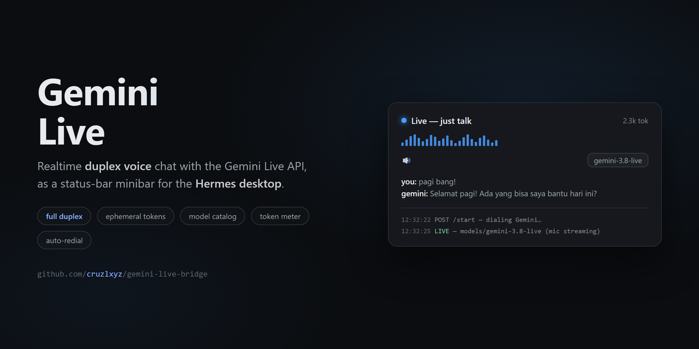

<p align="center"></p>

# Gemini Live Bridge

**Realtime duplex voice chat with the Gemini Live API — as a status-bar minibar for the Hermes desktop app.**

Talk to Gemini in real time (full duplex, barge-in supported), with a live transcript, a model catalog, thinking-level control, a session token meter, and transparent auto-resume — all from one small popover in your status bar.

> The renderer never talks to Google. A local Python backend owns the upstream WebSocket and your API key; the desktop UI only exchanges data with `localhost`.

---

## Features

- **Realtime duplex voice** — stream mic audio in, stream spoken answers out. Interrupt Gemini mid-sentence; it listens like a phone call.
- **Live transcript** — both sides rendered as flowing sentences (streaming fragments merged per speaker).
- **Model catalog** — every Live-capable model on your key, listed automatically via `ListModels`, in a fixed order (`gemini-3.8-live` first). Switch models from a dropdown.
- **Thinking level** — dedicated low/high picker for `gemini-3.8-live-extended-thinking` (the only config that model needs).
- **Session token meter** — real `usageMetadata` from Google, displayed as `12.3k tok`, reset per session. Handy on the free tier.
- **Session resumption + auto-redial** — if the connection drops (Wi-Fi hiccup), the backend reconnects itself using Google's session-resumption handle, keeping context. Manual stop never reconnects.
- **Secure by design** — the API key lives in `~/.hermes/.env` and never leaves the backend process. The UI gets short-lived single-use ephemeral tokens (the officially recommended browser flow).

## Requirements

- **Hermes desktop app** (plugin SDK surface) with desktop-plugin support enabled
- A **Google AI Studio API key** with Live API access — [get one here](https://aistudio.google.com/apikey)
- The key must be present as `GOOGLE_API_KEY` (or `GEMINI_API_KEY`) in `~/.hermes/.env`
- `websockets` Python package inside Hermes' environment (installed by default)

## Install (manual)

**1. Desktop UI** — copy `desktop/plugin.js` from this repo into your desktop-plugins folder:

```
~/.hermes/desktop-plugins/gemini-live-bridge/plugin.js      # Windows: C:\Users\<you>\AppData\Local\hermes\desktop-plugins\...
```

**2. Backend** — copy the backend into your plugins folder:

```
~/.hermes/plugins/gemini-live-bridge/manifest.json
~/.hermes/plugins/gemini-live-bridge/dashboard/plugin_api.py
```

**3. Enable it** in `~/.hermes/config.yaml` (append, don't replace, the list!):

```yaml
plugins:
  enabled:
    - disk-cleanup
    - gemini-live-bridge        # <- add this line
```

or via CLI:

```bash
hermes config set plugins.enabled '["disk-cleanup","gemini-live-bridge"]'
```

**4. API key** — put your key in `~/.hermes/.env`:

```
GOOGLE_API_KEY=AIza...
```

**5. Restart the Hermes desktop app** (backend changes need a restart; UI changes hot-reload via ⌘K → *Reload desktop plugins*).

### Install from the Hermes plugin catalog (planned)

Once admitted to the official catalog, this becomes:

```bash
hermes plugins install gemini-live-bridge
```

See [Hermes Plugin Catalog terms](#hermes-plugin-catalog-terms--compliance) below for the admission policy this plugin follows.

## Usage

1. Click **Gemini Live** in the desktop status bar (right side).
2. Press **▶** — the backend dials Google (token + Connect) and shows `LIVE` when the mic is streaming.
3. Just talk. Gemini's answer plays through your speakers; the transcript flows in the panel.
4. Press **⏸** to stop.

**Panel controls:**

| Control | What it does |
|---|---|
| `▶ / ⏸` | Start / stop the voice session |
| Model dropdown | Pick any Live-capable model on your key; fallback order preserved on failure |
| `Thinking: low / high` | Only shown for `gemini-3.8-live-extended-thinking` — reasoning depth |
| Token counter | Session token usage from Google's `usageMetadata` |
| Diagnostics log | Timestamped backend events (`dialing…`, `LIVE`, errors) |

**Tips**

- Use **headphones** — without them the mic can re-capture Gemini's voice (echo barge-in), which is the #1 cause of chaotic replies in every voice app.
- If a model goes **silent** (setup OK but no answer), that's a known Google-side "bursty" behavior — press Stop → Start, or pick the next model. The backend already tries candidates in order.
- `gemini-3.8-live-extended-thinking` + voice input can hit Google-side generation errors ("mohon maaf…") more often than plain `gemini-3.8-live`. Text-style patience recommended.
- Audio sessions are capped at **15 minutes** by Google — the token meter and log make that visible.

## Local backend endpoints

All routes are mounted by the Hermes plugin loader under
`/api/plugins/gemini-live-bridge/` on the desktop's local backend — no key material in any response.

| Method | Route | Purpose |
|---|---|---|
| `GET` | `/config` | `{ model, candidates[], resumable }` — Live-capable models from `ListModels`, filtered (no STT/translate), fixed order |
| `POST` | `/start` | Dial Google: mint ephemeral token → connect → `setupComplete`. Body: `{ model?, thinkingLevel?, resume? }`. Returns `{ ok, model, resumed }` |
| `POST` | `/audio` | Forward one mic chunk upstream. Body: `{ data: <base64 PCM16 mono 16kHz> }` |
| `GET` | `/poll` | Incremental session state: `{ session, model, error, interaction, usage, input[], output[], audio[], in_total, out_total, a_total, resumed }` — pass `?in_offset=&out_offset=&a_offset=` to get only new items |
| `POST` | `/close` | Tear down the session (blocks auto-redial) |
| `GET` | `/status` | `{ session, model, api_key_configured }` — health check |

Example:

```bash
curl http://127.0.0.1:<desktop-port>/api/plugins/gemini-live-bridge/status
# {"session":"idle","model":"","api_key_configured":true}
```

## Architecture

```
┌─ Hermes desktop (Electron renderer) ────────────┐
│  status-bar minibar + popover (plugin.js)       │
│  mic capture (WebAudio PCM16/16k)               │
│  playback queue (WebAudio PCM16/24k)            │
└──────────────┬──────────────────────────────────┘
               │ ctx.rest() → localhost only
┌──────────────▼──────────────────────────────────┐
│  Backend (plugin_api.py, FastAPI router)        │
│  • mints 1-use ephemeral tokens (30 min TTL)    │
│  • owns the upstream Live WebSocket             │
│  • auto-redial via session-resumption handle    │
│  • API key stays in this process                │
└──────────────┬──────────────────────────────────┘
               │ wss://…BidiGenerateContentConstrained?access_token=…
        Gemini Live API (v1alpha)
```

Why the proxy? The Live API's plain `?key=` endpoint is documented as server-to-server only; browser contexts (like the Electron renderer) must use ephemeral tokens, and direct renderer→Google sockets proved flaky (Chromium headers/proxies). The backend owns the upstream connection and has been the reliably verified path end-to-end.

## Hermes Plugin Catalog terms & compliance

This plugin targets the [official Hermes Plugin Catalog](https://github.com/NousResearch/hermes-agent/tree/main/plugin-catalog) (`category: voice`, `tier: community`). The catalog's admission policy — and how this plugin complies:

| # | Catalog rule | This plugin |
|---|---|---|
| 1 | Entries enter **only** via a reviewed PR to `NousResearch/hermes-agent` (no self-serve registry) | Will be submitted as a PR by the repo owner |
| 2 | **Exact 40-hex SHA pin** — installs check out the reviewed commit | Tagged release provides the pin |
| 3 | **No self-updating code** (updates happen via SHA-bump PRs + `hermes plugins update`) | No updater, no remote loaders |
| 4 | Version bumps = new reviewed PRs | Accepted |
| 5 | Submission by the **repo owner** | Submitted by [@cruzlxyz](https://github.com/cruzlxyz) |
| 6 | **Declared capabilities must match reality** — verified by `hermes plugins validate` | `capabilities: requires_env: [GOOGLE_API_KEY]`; registers no tools/hooks/middleware |
| 7 | **Security scan at admission** (`dangerous` fails) | No eval, no subprocess, no credential store access; key stays in the host process env |
| 8 | **Desktop plugins stay inside the SDK surface** — only `@hermes/plugin-sdk` + `react` imports; no `eval`/`new Function`, no prototype patching, no dynamic `import()`, no script-tag injection, no app-store reach-ins | Compliant: imports are `@hermes/plugin-sdk` and `react/jsx-runtime` only |

**For users, in plain words:** installing this plugin from the catalog gives you exactly the reviewed code; the plugin can only do what the Hermes plugin SDK allows; your Google API key is your own, stored in your own `.env`, and is never shipped, synced, or displayed by the plugin.

**Privacy:** transcripts and audio exist only in memory while a session runs; nothing is written to disk. (On Google's side, the free-tier data-use policy applies to the API key owner.)

## Troubleshooting

| Symptom | Cause | Fix |
|---|---|---|
| `GOOGLE_API_KEY not set` | Key missing in `~/.hermes/.env` | Add it, restart Hermes |
| `setup timeout` / `all candidates failed` | Google-side burstiness or key without Live access | Retry; check model availability in [AI Studio](https://aistudio.google.com) |
| Gemini answers then apologizes repeatedly | Server-side audio-generation error, common on extended-thinking + voice input | Switch to `gemini-3.8-live`, or lower thinking level |
| Answers choppy | Audio chunks overlapped (fixed in ≥1.0.1) / no headphones | Update; use headphones to avoid echo barge-in |
| Session dies at 15:00 | Google's audio-session limit | Start again (resumption keeps context when the drop is network-side) |

## License

MIT — see [LICENSE](LICENSE).
